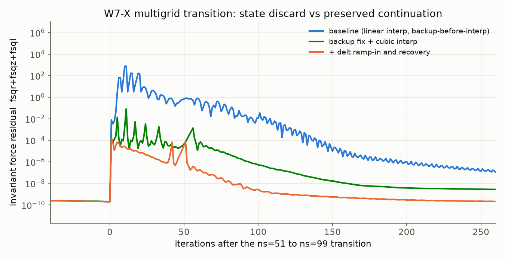
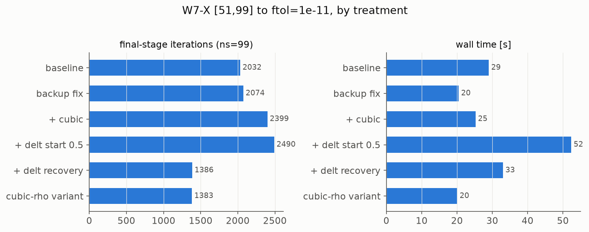
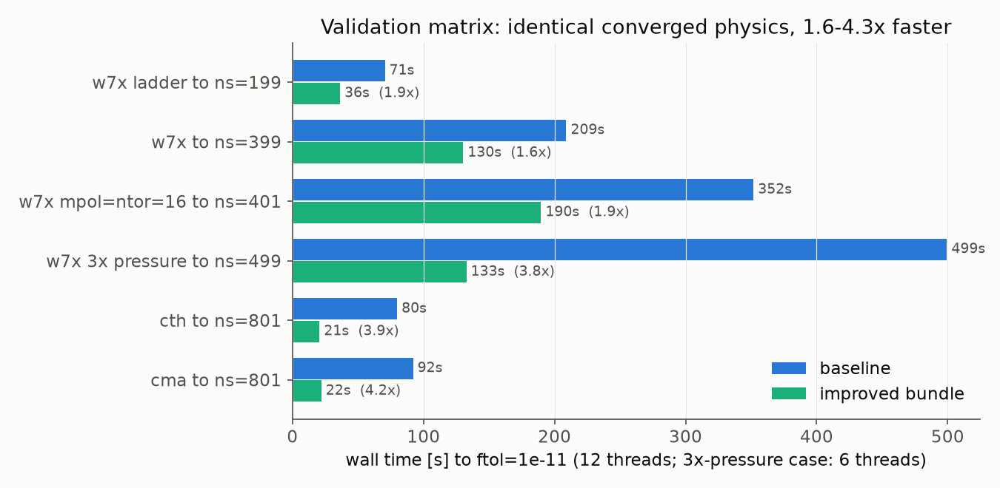

# VMEC++ convergence study: robustness and speed at high radial resolution

Working notes on improving VMEC++ convergence for stiff, high-`ns` equilibria
(W7-X, CTH-like, CMA test cases). Updated as experiments complete.

Benchmark setup: `w7x` (mpol=12, ntor=12, nfp=5), `cth_like_fixed_bdy`
(mpol=5, ntor=4), `cma` (mpol=5, ntor=6); multigrid ladders with intermediate
stage tolerance `ftol = 1e-10` and final tolerance `1e-11`; 12 OpenMP threads.

## Finding 1: baseline is robust but the final stage dominates cost

All three cases converge to `ftol = 1e-11` at every tested resolution
(up to ns=801 for cth/cma, ns=399 for w7x). There is no hard robustness
failure on these inputs; the problem is *cost growth*:

| case | ns ladder | total iterations | wall [s] |
|------|-----------|------------------|----------|
| cth  | 25..201   | 745 (final stage 744) | 3.3 |
| cth  | 25..801   | 2969             | 59   |
| cma  | 25..201   | 1224             | 4.0  |
| cma  | 25..801   | 7182             | 65   |
| w7x  | 13..99    | 2032             | 12.6 |
| w7x  | 13..199   | 3267 (final stage 2079) | 46 |
| w7x  | 13..399   | 5159             | 118  |

The final (finest) stage takes the large majority of iterations, and its
iteration count grows superlinearly with `ns`. The per-stage residual decay is
a smooth exponential tail at fixed `delt` -- the classic signature of a
condition-number-limited first-order descent.

## Finding 2: the multigrid ladder currently saves (almost) nothing

Striking head-to-head result:

| case | final stage | iterations, ladder | iterations, cold start at final ns |
|------|-------------|--------------------|------------------------------------|
| w7x  | ns=99       | 2031               | 2031 |
| cth  | ns=201      | 744                | 744  |

The final stage takes *exactly* as many iterations when seeded from the
converged coarse-grid solution as from a cold start. The trajectories are
byte-identical from ~iteration 100 onward (same residuals, delt, axis
position, MHD energy).

## Finding 3: mechanism -- the interpolated state is discarded at the first restart

The decisive detail (found by instrumentation, confirmed in the code): in
`InitializeRadial`, the rollback backup of the state vector is taken **before**
`InterpolateToNextMultigridStep` overwrites the state with the interpolated
coarse solution. The stage's rollback target is therefore the *cold
boundary+axis initial guess*, not the interpolated state. Within the first 10
iterations of a stage no new backup is taken (`iter2 - iter1 > 10` guard), so
the first restart of any kind silently replaces the interpolated state with
the cold guess. Combined with the stage-entry time-step instability (below),
this happens within ~5 iterations of every transition.

**Provenance (verified against the Fortran sources):** this ordering is
faithful to VMEC 8.52 -- `initialize_radial` calls `restart_iter` (with
`irst=1`, storing `xc` into `xstore`) *before* `CALL interp(...)` in VMEC
8.49, VMEC 8.52 / STELLOPT v251, and educational_VMEC alike, so it is an
inherited quirk, not a VMEC++ transcription error. Notably, S. P. Hirshman
identified and fixed exactly this in PARVMEC/VMEC2000 on 2017-01-24: the
comment `!SPH 012417: move this AFTER interpolation call` precedes the
relocated `irst = 1; CALL restart_iter(delt)` in
`PARVMEC/Sources/Initialization_Cleanup/initialize_radial.f` (and the same
change is in STELLOPT-master and hiddenSymmetries VMEC2000).
The backup-after-interpolation ordering therefore reproduces modern
PARVMEC/VMEC2000 behavior; based on this it has been made the VMEC++
**default** (split out as a standalone fix commit underneath this branch).
(Minor related deviation, opposite direction: Fortran interpolates from the
coarse stage's last `xstore` backup, VMEC++ from the fresher final `xc`.)

## Finding 3b: the stage-entry time step is unstable, and delt loss is permanent

Instrumented w7x `[51, 99]` transition (per-iteration invariant residual
`fsqr+fsqz+fsql` from `wout.force_residual_*`):

1. The converged ns=51 state ends at `fsq ~ 2e-10`. After linear radial
   interpolation onto ns=99, the invariant residual of the interpolated state
   is `~8e-3` -- the interpolation error re-injects seven orders of magnitude
   of force imbalance. (4-point cubic interpolation instead lands at
   `1.6e-4`, a ~50x improvement -- but see below, this alone changes nothing.)
2. `InitializeRadial` resets `delt` to the full user value (1.0) and the
   iteration counter to 1 at every stage. Iterating at `delt = 1.0` on the
   ns=99 grid is *linearly unstable* regardless of the starting state: the
   residual grows ~100x within 4 iterations (cold start and interpolated
   start alike).
3. The first restart then rolls back to the pre-interpolation cold guess
   (Finding 3), so from iteration ~5 the stage is exactly a cold start:
   `... -> 3.2 -> 66 -> 758 -> (restore 3.2) -> ...` until enough restarts
   chop `delt` to a stable ~0.5.
4. `delt` reductions are permanent within a stage (there is no growth
   mechanism), so the entire ~2000-iteration tail runs at delt ~0.5, i.e.
   roughly half the possible rate, even though the instability may only be a
   property of the stage-entry transient.

Additional observations:

- The backup criterion (`fsq <= res0`) uses only the *preconditioned*
  residual, which is tiny right after interpolation (~3e-11) even though the
  invariant residual is ~1e-2; the solver can back up states that are already
  diverging in the invariant norm.
- The opt-in `iteration_style = "parvmec"` (which additionally tracks the
  invariant residual minimum) makes this specific case *fail outright*
  (JACOBIAN_75_TIMES_BAD): its eager restarts keep re-entering the unstable
  delt regime until the retry budget is exhausted.
- Moving the backup to after the interpolation (now the default; during this
  study it was gated as `VMECPP_BACKUP_AFTER_INTERP`)
  preserves the interpolated state through restarts -- the stage then stays in
  the low-residual basin -- but by itself does NOT reduce iterations (2078 vs
  2039): each rollback still costs a delt chop, and the tail rate is
  proportional to delt. The delt dynamics and the state preservation must be
  fixed together.

## Finding 4: the fix is a bundle -- each lever alone loses, together they win

Treatments on w7x `[51, 99]`, final stage to `ftol = 1e-11` (iterations of the
final ns=99 stage; identical converged volume/beta to 6+ digits in all runs):

| treatment | final-stage iterations | vs baseline |
|-----------|------------------------|-------------|
| baseline (linear, backup-before-interp) | 2039 | -- |
| backup fix only                          | 2078 | +2% |
| backup fix + cubic interpolation         | 2403 | +18% |
| + delt ramp-in (start at 0.5 delt)       | 2488 | +22% |
| + delt recovery (full bundle)            | **1386** | **-32%** |
| full bundle, cubic in rho = sqrt(s)      | **1383** | **-32%** |



The figure shows the three regimes at the transition: the baseline explodes to
`fsq ~ 1e3` and is effectively re-solving from a cold start; backup fix + cubic
keeps cycling restore/blow-up around `1e-3` (each cycle chops delt, and the
lost delt makes the tail slower than baseline!); the delt-controlled bundle
continues smoothly from the interpolated `1.6e-4` downward.

Why each piece is necessary:

- Without the **backup fix**, the first restart replaces the interpolated
  state with the cold guess (Finding 3) -- nothing else matters after that.
- Without **delt ramp-in**, the stage-entry instability at full delt triggers
  restart cycles whose delt chops make the tail slower than the baseline,
  more than cancelling the better starting residual.
- Without **delt recovery**, the conservative entry delt (0.5) persists for
  the whole ~1400-iteration tail, which costs more than the transition saves
  (tail rate is proportional to delt).
- With all three, the stage converges from the interpolated seed at full
  delt: the multigrid ladder finally pays off. The delt recovery uses a
  per-stage stability ceiling (delt that caused a restart, times 0.95) so it
  does not oscillate against the stability boundary; the w7x run shows exactly
  one mild wobble while delt grows through the marginal zone, then a clean
  tail.

Design notes from tuning the recovery (each verified on the w7x nested ladder
[13,25,49,97,193], whose ns=49 stage originally stalled for 1397 iterations):

- **Stagnation guard**: a ceiling at 0.95x a failed delt can itself be weakly
  unstable -- the residual then creeps upward for hundreds of iterations while
  staying below the `100 * res0` blow-up threshold. A guard that triggers a
  BAD_PROGRESS rollback when no new preconditioned-residual minimum has
  occurred for 100 iterations turns that 1300-iteration stall into a <= 100
  iteration correction (the rollback lands on the best state, so it is nearly
  free).
- **The ceiling ratchet must stay one-directional.** Two tempting
  "improvements" were tried and both lose: a wider safety margin (0.9x) pins
  entire tails at an unnecessarily low delt learned from a stage-entry
  transient (final stage 1762 -> 2801 iterations); letting the ceiling heal
  upward (x1.002 per accepted step) creates a probe/fail limit cycle that is
  far worse (final stage -> 6508). Margin 0.95 + downward-only ratchet +
  stagnation guard is the stable combination.
- **Recovery only arms on interpolation-seeded continuation stages.** On a
  cold start there is no seed to protect and no ramp-in deficit to recover;
  re-probing near the stability margin after genuine-marginality restarts
  costs iterations (w7x ns=51 cold stage: +15% with recovery armed). Cold
  stages therefore run the unmodified 8.52 control, bit-identical -- the
  scheme never regresses single-stage or first-stage runs. The continuation
  stages keep the full win (w7x ns=99: 1817 -> 1108 iterations, restarts
  6 -> 1). The same gate exists in the Python port
  (`vmecpp._iteration`, style `"delt_recovery"`, armed by
  `delt_start_fraction < 1`).



(Wall times in the right panel are not load-controlled -- several runs shared
the machine with other benchmark jobs; the iteration counts are the reliable
metric here. Controlled wall times come with the full validation matrix.)

Gating: the backup ordering fix is now the default (standalone commit, see
Status section). The remaining levers are env-gated for experimentation:
`VMECPP_MULTIGRID_INTERP=cubic|cubic_rho`, `VMECPP_DELT_START=0.5`,
`VMECPP_DELT_RECOVERY=1`, and `VMECPP_PRESERVE_INTERP_SEED=1` (the
bad-Jacobian axis-recovery path restores the interpolated backup at reduced
delt instead of discarding an interpolation-seeded stage after a clean first
evaluation).

## Finding 5: poloidally coupled 2D preconditioner, phase 1 -- negative result

On top of PR #616's block-tridiagonal infrastructure (merged into this
branch), a first genuine 2D preconditioner was implemented behind
`VMECPP_PREC2D=coupled`:

- `computePreconditioningMatrix` additionally accumulates zeta-averaged,
  theta-resolved poloidal-coupling kernels (the same `pTau * t1b*t2b`
  integrands that are currently angle-averaged into the per-mode `bx`
  coefficients, kept per poloidal grid point).
- Per (R/Z component, poloidal shape cos/sin, toroidal mode n), the coupling
  matrices `B_mm' = sum_l kb(l) * dU_m/du(l) * dU_m'/du(l)` fill the
  off-diagonal (m != m') block entries; block diagonals stay exactly the 1D
  arrays (including edge pedestal and m=1 handling); odd-m rows/columns carry
  the sm/sp radial scale factors following the 1D assembly pattern.
- Factorizations are cached in HandoverStorage and rebuilt only on radial
  preconditioner updates (every 25 iterations), unlike the per-iteration
  refactorization of the diagonal block path.

Verification: with `VMECPP_PREC2D=1` (diagonal blocks only) results are
bit-compatible with the default per-mode solve (same iteration count, physics
to 12 digits). With `coupled`, all cases still converge to the same
equilibrium.

Performance verdict:

| case | default iters | coupled iters | coupled wall |
|------|---------------|---------------|--------------|
| cth ns=25, ftol=1e-13 | 827 | 769 (-7%) | ~2x slower |
| cth ladder to 201 (with bundle) | 323 | 322 | ~2x slower |
| w7x [51,99] (with bundle) | 1386 | 1786 (+29%) | ~2x slower |

The zeta-averaged kernel discards the n != 0 mode structure that dominates
W7-X shaping, and the hybrid diagonal (angle-averaged) is inconsistent with
the resolved off-diagonals -- on strongly 3D-shaped configurations this
misrepresents the Hessian badly enough to slow the descent. Documented as a
negative result; the implementation (and the imported block-tridiagonal
package it needed) has been removed from this branch again after this
evaluation -- it remains available in the branch history and in PR #616.
Follow-up directions, in order of expected merit: (a) per-n kernels (retain
the zeta dependence for same-n coupling), (b) angle-resolved radial (`ax`)
coupling and consistent resolved diagonals, or (c) sidestep analytic assembly
entirely with PR #616's `AssembleFdBlockTridiagonal` (finite-difference
Hessian, PARVMEC precon2d style) activated near convergence.

## Finding 6: validation matrix -- 1.6x to 4.3x across all stress cases

All cases use >= 3 multigrid stages, intermediate `ftol = 1e-10`, final
`1e-11`, 12 OpenMP threads (3x-pressure case: 6 threads). Converged volume,
aspect ratio, and beta agree between baseline and improved to 6+ digits in
every row.



| case | baseline iters / wall | improved iters / wall | speedup |
|------|-----------------------|------------------------|---------|
| w7x ladder to ns=199 | 3267 / 70.5 s | 1860 / 36.3 s | 1.9x |
| w7x to ns=399 | 5159 / 209 s | 3677 / 130 s | 1.6x |
| w7x mpol=ntor=16 to ns=401 | 6114 / 352 s | 3557 / 190 s | 1.9x |
| w7x 3x pressure to ns=499 | 10112 / 500 s | 3191 / 133 s | **3.8x** |
| cth to ns=801 | 2969 / 80 s | 730 / 21 s | 3.9x |
| cma to ns=801 | 7182 / 92 s | 1685 / 22 s | 4.2x |

Notes:

- The 3x-pressure W7-X case (beta ~ 12%, strong Shafranov compression of the
  outboard flux surfaces) is the requested "currently failing" stress case: at
  10112 iterations the baseline exceeds any customary `niter` budget (it only
  completes because the benchmark allows 40000); the bundle brings it into a
  normal budget with 3x margin.
- The gains grow with the number of stages: intermediate stages collapse from
  550-1800 iterations each to ~260-310, and the final stage starts from a
  preserved seed at recovered delt.

## Finding 7: ladder granularity -- the ladder finally beats a direct solve

w7x to ns=199, improved bundle, total force evaluations (all stages) and wall:

| ladder | final-stage iters | total evals | wall |
|--------|-------------------|-------------|------|
| standard [13,27,51,99,199] | 1860 | 3246 | 31.6 s |
| coarse [51,99,199] | 1888 | 2947 | 32.7 s |
| two-stage [99,199] | 2014 | 3216 | 37.9 s |
| fine 9-stage [13..199, ~sqrt(2) steps] | 1801 | 3808 | 33.5 s |
| direct [199] | 3550 | 3562 | 51.4 s |
| (baseline standard ladder) | 3267 | 5966 | 58.3 s |
| (baseline direct [199]) | 3267 | 3279 | 47.9 s |

- Baseline: the ladder is *slower* than a direct solve (58.3 vs 47.9 s) --
  consistent with Finding 2.
- Improved: the ladder beats direct by 1.6x, and coarse-grained ladders
  (2x steps) are the sweet spot. Very fine ladders do not pay yet: each
  transition still costs ~250-300 iterations of re-convergence, because even
  the cubic interpolant re-injects ~1e-4 of residual (7 decades above the
  converged coarse state). Making transitions cheaper still -- e.g.
  physics-informed placement of new surfaces (curvature-aware/solving a 1D
  force-balance for the radial positions) or interpolating in a
  flux-label-adapted variable -- is the direct route to profitable
  fine-grained ladders, and remains open.
- `delt > 1` probing is currently impossible: `VmecInput` validates
  `delt in ]0, 1]`. With the recovery ceiling in place, relaxing this bound
  is a natural follow-up (the ceiling would self-limit an over-aggressive
  user delt).

## Finding 8: the transition residual floor is discretization truncation error; Richardson extrapolation is the way below it

### The question

After the bundle, each transition still injects a residual floor (~1e-4 at
51 -> 99, costing ~250-300 iterations of re-convergence per stage). Is this
interpolation error -- fixable by yet-better, physics-informed interpolation
(flux-conserving projection, curvature-aware surface placement) -- or
something more fundamental?

First, on flux conservation: in VMEC's inverse representation there is no
flux defect to project out. The radial coordinate `s` *is* the (normalized
toroidal) flux label, and `B` is derived from the prescribed flux profiles on
whatever geometry exists (`phipH = maxToroidalFlux * torfluxDeriv(s)` in
`radial_profiles.cc`; `bsupv ~ phip (1 + lambda_theta) / sqrtg`). Any
interpolated geometry carries exactly the right flux between surfaces by
construction. The meaningful analog of a fluid pressure re-distribution would
be a 1D radial re-equilibration (shift surfaces along s until the
angle-averaged radial force vanishes) -- but the experiment below shows even
that cannot reach below the observed floor.

### The discriminating experiment

If the floor were interpolation/placement error of the coarse *data*, a
"nested" ladder with `ns_new = 2 ns_old - 1` -- where every coarse surface
coincides exactly with a fine-grid point, so the interpolant is *exact* at
half of the new points -- should inject less residual than the standard
non-nested ladder. Measured (w7x, improved bundle, injected invariant `fsq`
at each transition):

| ladder | injected residual per transition |
|--------|----------------------------------|
| nested [13,25,49,97,193] | 1.6e-3, 4.9e-4, 1.9e-4, 4.4e-5 |
| non-nested [13,27,51,99,199] | 1.8e-3, 4.1e-4, 1.3e-4, 5.2e-5 |

Identical within noise -- and both fall ~4x per doubling of ns, i.e. the
floor scales as `h_old^2` (h = radial grid spacing).

### What "truncation error" means here

Not floating-point roundoff (that lives at ~1e-16; the floor is 1e-4..1e-3).
It is the *Taylor-series truncation* of VMEC's second-order radial
discretization: central differences across the staggered full/half grid,
half-grid metric quantities, trapezoidal radial quadratures. Because of it,
the converged coarse state `x_H` solves the *discrete* equations
`F_H(x_H) = 0`, whose solution differs from the continuum equilibrium `x*`
by a smooth O(h_H^2) profile:

    x_H(s) = x*(s) + e(s) * h_H^2 + O(h_H^4),

with `e(s)` a grid-independent error function. The fine-grid solution
likewise sits at `x_h = x* + e h_h^2`. So even a *perfect* representation of
the coarse solution on the fine grid -- zero interpolation error, perfect
surface placement -- is still a distance

    x_H - x_h = e(s) (h_H^2 - h_h^2)   (= 3/4 e h_H^2 for 2x refinement)

from where the fine stage needs to go, and the fine-grid force operator
reports that O(h_H^2) discrepancy as the injected residual. This explains all
three observations at once: (i) nesting doesn't help (the discrepancy is a
property of the *solutions*, not of the interpolant); (ii) the floor scales
as h^2; (iii) cubic interpolation (whose own error is O(h^4), already below
the floor) stopped helping once it got the interpolation contribution out of
the way -- and no single-level interpolant, however physics-informed, can do
better than reproducing `x_H` exactly.

### Why Richardson extrapolation goes below the floor

The h^2 error structure is *known* once two converged levels are available.
With `x_49` and `x_97` (grid halving, h_49 = 2 h_97), subtracting the two
expansions gives `x_97 - x_49 = -3 e h_97^2 + O(h^4)`, so the error profile
`e(s)` can be eliminated without ever knowing it:

    continuum estimate:  x* ~ x_97 + (x_97 - x_49) / 3        + O(h^4)
    fine-grid target:    x_193 ~ x_97 - (x_97 - x_49) / 4     + O(h^4)

(the second form predicts the fine-grid solution *including its own* h^2
error, coefficient (h_97^2 - h_193^2)/(h_49^2 - h_97^2) = 1/4). Both levels
are radially interpolated to the fine grid first (cubic, per scaled Fourier
coefficient), then combined pointwise. The h^2 term cancels; the seed's
distance to the fine solution drops from O(h_H^2) to O(h_H^4) -- at these
resolutions an expected further ~10-50x cut in injected residual, which is
precisely what would make fine-grained ladders profitable (Finding 7's
remaining bottleneck of ~250-300 iterations per transition).

Prerequisites and caveats: both stages must be converged well below their
truncation level (the intermediate `ftol = 1e-10` is ample); `e(s)` must be
smooth, which can degrade near the axis (odd-m extrapolation region) and
wherever the discretization is not cleanly second order -- so the practical
implementation should blend (use the extrapolated seed, fall back towards
plain interpolation where the two-level difference is not smooth), and it
requires keeping the previous stage's converged state alongside the current
one in `InterpolateToNextMultigridStep`. Not yet implemented; this is the
top-priority follow-up on the interpolation track.

## Finding 9: the stage-entry stability limit depends on the equilibrium, only weakly on the ns-jump size

Question: should the entry step fraction (`VMECPP_DELT_START`) scale with the
size of the ns jump? Hypothesis: a larger jump makes the fine problem
stiffer relative to the seed, shifting the entry stability limit.

Method: for four equilibria (w7x, cth, cma, li383) converge a coarse stage
(ns_old = 25; for w7x also ns_old = 13), interpolate (cubic) to
ns_new/ns_old ratios of ~1.5 / 2 / 3 / 4, and from the *identical* seed
(state snapshot, zeroed velocity) probe 120 iterations of the plain 8.52
control at entry delt fractions 1.0 ... 0.3. A probe is stable if no revert
fires and the residual decays net. (Python loop, `solve_equilibrium` with
`delt_start_fraction`; script in the session workspace.)

Largest stable entry fraction:

| case (ns_old) | r ~ 1.5 | r ~ 2 | r ~ 3 | r ~ 4 |
|---|---|---|---|---|
| w7x (25)   | 0.6 | 0.6 | 0.6 | 0.5 |
| w7x (13)   | 0.8 | 0.8 | 0.6 | 0.6 |
| li383 (25) | 0.8 | 0.8 | 0.6 | 0.6 |
| cth (25)   | 1.0 | 1.0 | 1.0 | 1.0 |
| cma (25)   | 1.0 | 1.0 | 1.0 | 1.0 |

Findings:

- **The equilibrium dominates; the jump ratio is a weak second-order
  effect.** cth and cma enter stably at the *full* user delt at every ratio
  up to 4x -- for them the jump size is irrelevant. w7x and li383 are
  entry-unstable already at r = 1.5, and quadrupling the jump only lowers
  their stability limit by ~25% (0.8 -> 0.6, 0.6 -> 0.5).
- Analytic frame: the Garabedian stepper is linearly stable for
  delt < 2/sqrt(mu_max) of the preconditioned Hessian. The radial
  preconditioner is rebuilt on the seeded fine-grid geometry, so radial
  stiffness is normalized regardless of the jump -- which is why benign
  configurations enter at full delt at any ratio. What the preconditioner
  does *not* normalize is the poloidal/toroidal mode coupling of strongly
  shaped configurations (the same deficiency Finding 5 probes), so
  mu_max > 4 on fine w7x/li383 grids independent of how the stage was
  seeded. The jump ratio enters only through the seed error amplitude
  (measured entry residual grows ~r^3), which shortens the time to the
  first revert but barely moves the linear boundary. Growth-rate analysis
  of the unstable probes confirms marginal (not strongly super-critical)
  instability at every unstable fraction.
- **Consequence: scheduling delt_start on the jump ratio is not the right
  lever.** A ratio-based formula is either too conservative for benign
  configurations (which tolerate 1.0 at r = 4) or too aggressive for shaped
  ones (unstable at 0.8 even at r = 1.5). A fixed entry fraction of 0.5 was
  stable for every (case, ratio) tested, and the delt recovery erases its
  cost within ~35 iterations. The information that *would* justify a larger
  entry step is per-configuration, and the run already learns it: the
  stability ceiling of the previous stage. Seeding the next stage's entry
  delt from the previous stage's learned ceiling (instead of a fixed 0.5)
  is the natural follow-up.

## Finding 10: tail anatomy -- the stability ceiling is static and mildly stale; the rate limit is the spectrum, and lambda is the slow channel

Two questions about the slow late-convergence regime (the "corner-filling"
phase of strongly shaped equilibria): (A) is the time-step ceiling learned at
stage entry stale by the time the iteration is in the tail, i.e. can delt be
raised there? (C) what is actually converging slowly?

Method (`examples/delt_tail_study.py`): converge ns=25, refine (cubic) to
ns=99, run the fine stage with the delt_recovery control, snapshot the state
at the first crossing of fsq = 1e-6 / 1e-9 / 1e-12, and from each identical
snapshot probe 200 iterations of the plain 8.52 control at effective delt
values up to 3x the user delt (the probe bypasses the input bound). Unstable
probes yield the implied stability boundary delt_crit = 2/sqrt(mu) from the
early residual growth factor; at each snapshot the force residual is
decomposed by family (R/Z/lambda), poloidal m, and radial third, for both the
preconditioned search direction and the raw gradient.

(A) Stability ceiling along the tail (delt values, not fractions):

| case (user delt) | running at | implied delt_crit 1e-6 | 1e-9 | 1e-12 |
|---|---|---|---|---|
| w7x (1.0)   | 0.55-0.58 | 0.69-1.26 | 0.65-0.68 | 0.67-0.84 |
| cth (0.7)   | 0.70      | 1.05-1.83 | 1.03-1.31 | 1.05-1.97 |
| cma (0.5)   | 0.50      | 0.97-1.27 | 0.75-0.98 | 0.75-0.99 |
| li383 (0.9) | 0.62      | 0.87      | 0.87-1.23 | 0.87-1.24 |

(The spread at each snapshot is over probe amplitudes; the smallest value is
the relevant near-marginal estimate, and it matches the observed
stable/unstable probe boundary in every case.)

- **The boundary is static across the tail**: delt_crit at fsq = 1e-12 equals
  the value at 1e-6 within measurement spread. The spectrum does not soften
  as the corners fill in; there is no growing delt budget to harvest late.
- **The learned ceiling is mildly stale, not grossly**: 20% headroom on w7x
  (0.55 vs ~0.67), 40% on li383 (0.62 vs ~0.87). For cth and cma the binding
  constraint is the *user delt itself*: their true tail boundary sits at
  ~1.5x (cth: 0.7 vs ~1.05) and ~1.5-2x (cma: 0.5 vs ~0.75-0.99) the input
  value. This, together with the audit that no formula in the descent
  requires delt <= 1 (the damping term is scale-invariant in delt), is why
  the input bound was raised from ]0,1] to ]0,10].
- **The payoff of a larger step is real but bounded**: stable-probe decay
  rates improve roughly linearly with delt (cth at 1e-12: 0.989/iter at
  delt 0.28 -> 0.976 at 0.70, i.e. ~2.3x fewer iterations), so recovering
  the 20-50% delt headroom buys a comparable iteration reduction -- and no
  more. On w7x the 200-iteration probes with restarts show *flat* net rates
  (~0.9995) regardless of the attempted delt: the 8.52 control's
  cut-and-never-recover dynamics eat exactly what the larger step gains.
  Beating the tail wholesale requires attacking the spectrum width
  (Anderson/NLGMRES or a Newton-Krylov finisher), not the step size.

(C) What is slow (preconditioned residual = what the control watches):

- Through the bulk of the tail (fsq 1e-6 .. 1e-9) the preconditioned residual
  is **78-99% lambda** on every equilibrium, concentrated at low m (m=0/1)
  in the core. The invariant residual is R-dominated at the same snapshots,
  i.e. the lambda channel is slow specifically *after* preconditioning --
  the lambda preconditioner (faclam) under-relaxes the low-m core lambda
  modes relative to R/Z.
- At the very end (fsq ~ 1e-12) the picture shifts to the **highest resolved
  poloidal mode at mid/edge radius**: w7x Z(m=11) carries 49% of the
  preconditioned and 70% of the raw residual (mpol=12); cma R/Z(m=3,4) at
  the edge carry ~87-90% of the raw residual (mpol=5). This is the spectral
  signature of the flux surfaces stretching into the boundary corners: the
  solution wants m > mpol content, and the highest-m coefficients converge
  last through their coupling to the truncated tail.
- Two concrete levers follow: (i) revisit the faclam scaling for the low-m
  core lambda modes (cheap, targets the 1e-6..1e-9 bulk); (ii) for the
  endgame, the slow subspace is low-dimensional and mode-identifiable --
  ideal conditions for Anderson acceleration, which builds exactly such a
  low-rank model, or for per-mode step scaling on the top-m block.

(B) Ceiling forgetting: negative result, twice confirmed. Letting the
learned ceiling drift back up during quiet stretches (1.002/store after
100 clean iterations, overdrive cap 2x the user delt) was implemented in
the Python delt_recovery style and A/B benchmarked on [25,99] ladders:

| case | stage-2 iters, one-way ratchet | with forgetting | restarts |
|---|---|---|---|
| w7x   | 1646 | 4354 | 2 -> 22 |
| cth   | 452  | 547  | 0 -> 3  |
| cma   | 1032 | 1923 | 0 -> 9  |
| li383 | 611  | 947  | 2 -> 7  |

Every case regresses. The mechanism is structural, not a tuning issue: the
drift has no stopping criterion, so it grows the step *until it fails* --
a ~200-iteration probe/fail limit cycle (100 quiet + ~85 drift + revert)
whose revert spikes cost far more than running marginally hotter earns.
The running iteration also reverts *below* the snapshot-probe boundary
(cma at 0.71 vs measured ~0.75+): a mid-flight step increase with live
velocity and damping history calibrated at the old delt is less stable
than the zero-velocity probes suggest. Matches the earlier C++ prototype
attempt (comment at the recovery site in vmec.cc); the ratchet stays
one-directional. The delt headroom identified in (A) is instead
harvested by raising the *user* delt (bound now ]0,10]), which the
recovery treats as its cap: entry stays at 0.5x, growth stops at the
learned ceiling, and no limit cycle exists because the cap is static.

Verification of that route ([25,99] ladders, delt_recovery, total
stage1+stage2 iterations vs user delt):

| case | default delt | raised | result |
|---|---|---|---|
| cth | 0.7: 801 | 0.9: 688 | -14%; at 1.0: 690, restarts appear |
| cma | 0.5: 1990 | 0.7: 1622 | -18%; at 0.75: 1717, 7 entry restarts |
| w7x | 1.0: 2018 | (0.7: 2047) | indifferent -- binding constraint is the learned ceiling ~0.6, not the input |

Raising the user delt to ~85% of the measured tail boundary is worth
10-20% on the equilibria whose boundary exceeds their conventional input
value; pushing to the boundary itself adds reverts for no further gain.

## Finding 11: the lambda-preconditioner headroom is real on strongly shaped configurations (-22% on w7x), absent on benign ones

Following the Finding 10 anatomy (preconditioned residual dominated by low-m
lambda), the lambda preconditioner's inherited scalings were consolidated
into `vmec_algorithm_constants.h` as named hyperparameters
(`kLambdaPreconditionerDampingFactor` = 2, `kLambdaPreconditionerZeroGuard`
= -1e-10, `kLambdaHighMDampingReferenceM` = 16,
`kLambdaHighMDampingMaxPower` = 8), and experimental scale / mmax knobs
were added for the studies below. (The env-var knobs used during the
studies have since been replaced by the exposed API:
`VmecModel.set_lambda_preconditioner_boost(scale, mmax, jmax)` and
`solve_multigrid(lambda_preconditioner_boost=True)`; only the high-m guard
override `VMECPP_LAMBDA_HIGHM_REF_M` remains env-gated as a research
knob.) A preconditioner rescaling cannot move the fixed point, so
converged physics is invariant (verified: MHD energy agrees to 9 digits
across all probes below).

Method (`examples/lambda_precond_study.py`): snapshot the seeded ns=99
stage at fsq = 1e-6, continue to ftol = 1e-11 from the identical snapshot
under different scalings. Iterations to convergence:

| case | 1.0 (base) | 2.0 | 5.0 | 10.0 | 0.5 | 5.0, m<=1 | 10.0, m<=1 |
|---|---|---|---|---|---|---|---|
| cth | 397 | 387 | 392 | 513 (2 rev) | 415 | 414 | 490 (1 rev) |
| cma | 979 | 1029 | 1066 | 1158 | 979 | 1243 | 1269 |
| w7x | 1979 | 1639 | 1536 | 1567 | 2301 | 1529 | **1518** |

Findings:

- **On w7x the headroom is real: -22%** at scale 5-10, monotone counter-probe
  (halving the scale costs +16%), plateau past 5x. The m<=1-restricted boost
  matches the full boost and tolerates 10x without extra reverts -- consistent
  with the Finding 10 diagnosis that specifically the low-m lambda modes are
  under-relaxed on strongly shaped configurations.
- **On cth/cma there is nothing to collect** (cth -2% at best, destabilizes
  at 10x; cma strictly worse at every boost). This sharpens the
  interpretation of Finding 10: a lambda-dominated preconditioned residual
  is *necessary but not sufficient* evidence that the lambda block limits
  the rate. On cma (97% lambda share, zero response to a 10x boost) the
  lambda content of the slow mode is slaved to the geometry -- lambda
  relaxes quasi-statically along the slow R/Z motion, so scaling its
  preconditioner block changes the mode's shape, not its rate. On w7x the
  response proves genuine lambda-limited stretches.
- Even after the boost the final preconditioned residual is still 72-83%
  lambda: the boost speeds the lambda-limited stretch up but does not
  exhaust the channel; past scale ~5 the next constraint binds (on w7x
  plausibly the Z(m=11) corner modes of the endgame anatomy).
- Physics interpretation of the block: faclam is the diagonal of the second
  variation of the magnetic energy with respect to lambda_mn (an
  anisotropic, metric-weighted surface Laplacian), with flux-surface
  averages in place of the mode-coupled metric. The suspicious pieces are
  the fudge factors around it, now named constants.

Open follow-ups: (i) a radially-restricted boost to locate the
under-relaxed surfaces (resolved in Finding 12: the entire effect is the
first evolved surface j = 1; the initially suspected axis extrapolation
`bLambda[0] = bLambda[1]` is inert -- lambda has no evolved DOF at the
axis, the force loop starts at jF = 1); (ii) the high-m damping
sqrt(s)^((m/16)^2) needs mpol = ntor > 16 cases to understand what it
guards against (resolved in Finding 12: not needed in the tested
envelope).

## Finding 12: lambda boost hyperparameter scan, the fat lambda m-spectrum, and the radial split of the slow lambda modes

Scan (`examples/lambda_precond_scan.py`) over VMECPP_LAMBDA_PRECOND_SCALE x
VMECPP_LAMBDA_PRECOND_SCALE_MMAX, including mpol = 18 variants (zero-padded
via `_set_mpol_ntor`, ns [13,49]) since the high-m lambda damping
sqrt(s)^((m/16)^2) is nearly inert below mpol ~ 12.

Iterations from the fsq = 1e-6 snapshot to ftol = 1e-11:

- **w7x [25,99]: the optimum is flat and low-m.** scale 5-10 with mmax 1, 2,
  4 or all are indistinguishable (1518-1540 vs 1979 baseline, -23%); mmax = 1
  already saturates the gain, consistent with the anatomy below.
  Recommended setting: `SCALE=5, MMAX=1`.
- **w7x18 [13,49]: same shape, smaller gain** (1296 -> 1110-1158, -11 to
  -14%); at scale 10 x all-m the full-spectrum boost costs an extra revert
  while m-restricted variants stay clean -- the first sign of the high-m
  guard's purpose.
- **cma18: still nothing** (every boost slows it, up to +46%); raising mpol
  does not create lambda headroom on benign shapes.

Truncation spectra (physical amplitudes per m, converged states, ns = 49):
the lambda family has a much fatter poloidal spectrum than R/Z. Top-mode
amplitude relative to the family peak:

| case | R | Z | L |
|---|---|---|---|
| w7x mpol=12 | 3.2e-6 | 6.3e-5 | 8.2e-4 |
| w7x mpol=18 | 1.4e-6 | 2.3e-5 | 1.7e-4 |
| cma mpol=5  | 1.8e-3 | 3.2e-3 | 4.3e-2 |
| cma mpol=18 | 4.8e-6 | 1.8e-5 | 1.6e-3 |

At any practical mpol the top lambda modes carry real truncated content
(1e-3..1e-4 of peak), unlike R/Z which reach their floor. This is the
context for the high-m guard: lambda's marginally-resolved top-m band is
exactly where the flux-surface-averaged faclam is least trustworthy (it
misses the ~ s^(m/2) radial envelope near the axis).

**Direct guard test (VMECPP_LAMBDA_HIGHM_REF_M, mpol = 18, [13,49],
fsq = 1e-6 snapshot to 1e-11):** within tested territory the guard is not
needed -- and only costs performance:

| ref m | w7x18 | cma18 |
|---|---|---|
| 16 (default) | 1296 (4 rev) | 1681 |
| 32 | 1275 (4 rev) | 1692 |
| off (1e6) | 1266 (4 rev) | 1684 |
| 8 (stronger) | 2256 (4 rev) | 6602 |

Turning the guard off entirely destabilizes nothing (identical revert
counts) and is marginally *faster*; extending the damping down to m ~ 8
is disastrous (cma18 +4x) -- direct evidence that the mechanism (damping
lambda steps radially inward) actively slows convergence wherever it
engages. Caveats: fixed-boundary, mpol <= 18 (only m = 17 lies beyond the
reference; the exponent cap only saturates at m >= 45), ns <= 49. Whatever
instability Hirshman guarded against needs mpol substantially above 16 or
another regime (free boundary, no radial preconditioner) to manifest;
within the tested envelope the guard could default to off.

Radial anatomy of the slow lambda modes (w7x [25,99] snapshots): the lambda
channel splits into two distinct phenomena.

- At fsq ~ 1e-6, 91% of the preconditioned lambda residual sits within the
  innermost 8 of 99 surfaces, dominated by (m=0, n=1..4) peaking at
  j = 1..3.
- At fsq ~ 1e-9 the near-axis modes are converged (j < 8 holds 2%); the
  slow lambda mode is now (m=1, n=0) peaking at mid-radius j = 23 with 94%
  of the lambda residual.

**Radial attribution (jmax-restricted boost, w7x [25,99], scale 5,
m <= 1):** the entire effect is the single first evolved surface.

| boost extent | iterations |
|---|---|
| none (baseline) | 1979 |
| j = 0 only | 1979 (bit-identical) |
| **j <= 1** | **1520** |
| j <= 2 | 1551 |
| j <= 4 | 1551 |
| all j | 1529 |

The j = 0 probe is exactly the baseline: lambda has *no evolved DOF at
the axis* (theta is undefined on the axis curve; the lambda force loop
starts at jF = 1 and the j = 0 preconditioner slot is zero-filled), so
the initially suspected constant axis extrapolation
`bLambda[0] = bLambda[1]` feeds nothing and is NOT the defect. Boosting
j <= 1 alone recovers the full -23% (marginally better than the
whole-radius boost). The near-axis expansion gives
bLambda = <g_uu/sqrt(g)> ~ s (g_uu ~ s, sqrt(g) -> const), and the
half-to-full averaging 0.5 (b_{1/2} + b_{3/2}) is exact for that linear
part -- so the ~5-10x overestimate of what the descent feels at j = 1
(boosts up to 10x neither destabilize nor add reverts) is NOT a simple
assembly error of the linear term. Candidate mechanisms for the residual
mystery: the half-grid metric quality on the innermost tiny surfaces,
the lambda(0) = 0 boundary condition entering the discrete operator
asymmetrically at j = 1, or the effective stiffness of the coupled
axis-position + lambda "polish" modes being genuinely lower than the
surface-local faclam estimate. The mid-radius (m=1, n=0) mode that
dominates the deep-tail lambda residual *share* contributes almost
nothing to the iteration count -- slow but slaved, the same lesson as
cma in Finding 11.

Deployed: `VmecModel.set_lambda_preconditioner_boost(scale=5, mmax=1,
jmax=1)`, exposed as `solve_multigrid(lambda_preconditioner_boost=True)`
(orthogonal to `iteration_style`; the wrapper re-applies the setting
after every InitializeRadial so it survives multigrid transitions and
mid-stage axis reguesses) and compared as a variant in
`examples/iteration_dynamics.py`. On cma [51,199] the boost costs ~4%
(the known-unresponsive case); on w7x it is -23%.

Related deployment: `solve_multigrid` now supports delt > 1 inputs with
the delt_recovery style by entering *cold* stages at the universally
stable absolute step 0.5 (Finding 9) instead of the full user delt -- a
cold start at delt = 2 dies in the initial transient under the plain
8.52 control, but with the armed recovery it grows the step toward the
requested cap bounded by the learned ceiling. On the example's cma
[51,199] ladder the delt = 2 variant is the fastest of all
(1939 iterations vs 1997 for vmec_8_52): the cold stage benefits from
growing past cma's conservative default delt = 0.5 (stage 1: 968 -> 767),
and the fine stage walks down from the over-large entry with two cheap
reverts. Cold starts at delt <= 1 keep the machinery off (bit-identical
to vmec_8_52).

## Finding 13: Anderson acceleration does not beat the native momentum iteration -- the tail spectrum is a near-continuum, not low-rank

Prototype (`examples/anderson_tail_study.py`): type-II Anderson mixing on
the fixed-point map G(x) = x + eta P F(x) (eta = delt^2/2; P F from the
existing preconditioned force), depth 8..60, SVD least squares with
rcond / Tikhonov regularization, gamma caps, reject-and-fallback at 10x
residual growth, history cleared on preconditioner refresh. Benchmarked
from identical fsq = 1e-6 snapshots to fsq < 1e-11 ([25,99], cubic):

| case | baseline (delt_recovery) | best Anderson variant |
|---|---|---|
| cth | 441 evals | 1359 evals (m=8, rcond 1e-10); m=60 frozen-P: not converged in 4000 |
| w7x | 1590 evals | not converged in 4000 |

Diagnosed mechanism, not a tuning failure:

- The plain Richardson map is smooth, stable, monotone, with effective
  kappa ~ 300 on cth; the native second-order damping already delivers the
  sqrt(kappa) momentum rate (0.974/iter vs the plain map's 0.9984/iter).
  Anderson must build a GMRES-degree ~50 polynomial just to match it.
- The decisive diagnostic: the Anderson least squares explains only ~1% of
  the residual at every depth (8 and 60), every regularization, with and
  without a frozen preconditioner. The slow subspace is a
  **near-continuum of radial modes within each (m,n) family**, not a
  handful of eigenvectors -- Finding 10's "low-dimensional" refers to
  family/m residual *shares*, not eigenvalue count. Cancelling the
  residual requires mixing coefficients gamma ~ 1/(eta mu_min) ~ 1e3-1e7,
  at which amplification nonlinearity destroys the secant model;
  regularizing the coefficients away reduces Anderson to a perturbation
  of the slow plain map.
- A composite map of K native steps loses the kNDamp = 10 momentum ramp at
  every block boundary (the velocity is not exposed through pybind), and
  is worse than both.

Consequences: (i) the useful acceleration frame for this solver is
momentum + spectrum compression (better preconditioning), not Krylov-style
recombination on top of the scalar-damped step; (ii) if Anderson (or
deflation) is revisited, it needs either a genuinely low-rank residual --
e.g. downstream of a radially-coupled (block-tridiagonal) preconditioner
that collapses each family's radial continuum -- or the (x, v) phase-space
map, which requires exposing the velocity in the pybind API first.

## Finding 14: the slow tail subspace is an axis-localized, cross-family m=1
lambda cluster; the lambda(0)=0 diagonal-asymmetry hypothesis is refuted

Finding 12 left open why the effective stiffness of the m <= 1 lambda modes
on the first evolved surface is ~5-10x below faclam's estimate. Direct
measurement (examples/lambda_j1_stiffness_study.py: Hessian columns via the
pybind hessian_vector_product at a w7x [25,99] tail snapshot, mapped through
apply_preconditioner, so the recorded columns are columns of the effective
iteration matrix B = M^{-1} H in the descent coordinates) settles it:

- The preconditioned diagonal at js=1 is HEALTHY: B_11/plateau = 1.24-1.33
  for every lambda family probed (m=0 n=1,2; m=1 n=0,1), and 0.94 for the
  R reference channel. faclam does NOT overestimate the diagonal at js=1;
  the lambda(0)=0 boundary condition introduces no local diagonal defect.
  The hypothesis "the fix would be exact rather than a tuned factor 5" is
  refuted at the diagonal level -- there is no diagonal to fix.

- Radially, each (m,n) lambda family Hessian is EXACTLY tridiagonal (the
  measured beyond-tridiagonal entries are zero to FD noise), with
  nearest-neighbor couplings 0.42-0.63 of the diagonal that sum to ~1.0:
  the half-grid averaging lambda_{j+1/2} = (lambda_j + lambda_{j+1})/2 makes
  the family block a near-singular chain. Its soft end is a family of
  grid-scale ALTERNATING (checkerboard) modes, mu down to 5e-6 for m=0
  (condition number 1e5) -- the near-null space of the averaging operator.
  These checkerboards are invisible to |B| (only half-grid averages enter
  the energy), carry no force, and do NOT limit convergence: the js<=1
  boost leaves their spectrum unchanged to 5 decimals while empirically
  cutting the tail 23%, so they are not the slow channel.

- The true slow channel appears in the cross-family probe (all spans,
  js in {0,1,2}, m <= 1, all n; snapshot at fsq ~ 1e-9): the softest modes
  with significant residual overlap are m=1 LAMBDA modes localized at
  js=1-2, strongly mixed ACROSS toroidal harmonics n and across both parity
  spans (lsc and lcs), with mu ~ 1.5e-3 .. 5e-3 -- roughly 100x softer than
  the faclam diagonal (0.25) -- and force overlaps up to 0.43. The
  unboosted residual direction also carries comparable axis-position
  content (rcc m=0 n=0 at js=0-2), confirming the coupled
  axis-position + lambda "polish" picture. Off-family coupling at js=1 is
  2-3x the diagonal (an lsc m=1 column at js=1 leaks 0.44-0.76 into
  lcs m=0 n=1 at js=1): on the innermost, strongly shaped surfaces the
  flux-surface-averaged metric behind faclam misses the angular mode-mode
  coupling entirely, and near-cancelling combinations are much softer than
  any diagonal entry suggests.

- Why the 5x boost helps only 23%: it lifts the soft cluster modes by a
  modest 13-48% (e.g. mu 0.00145 -> 0.00164, 0.00465 -> 0.00690) -- it
  rescales one row of a coupled block rather than inverting the block, so
  most of the softness survives. This also explains why scale 10 was no
  better than 5 (Finding 12): the row scaling saturates.

- The principled within-family fix simulates perfectly: preconditioning a
  measured family block with the EXACT tridiagonal (a Thomas solve per
  (m,n) family, same infrastructure as the existing radial R/Z
  preconditioner) maps every family eigenvalue to mu = 1.000. Caveats
  before promoting it: it exactly inverts the near-singular chain, i.e.
  amplifies checkerboard components by up to the condition number 1e5
  (probably benign -- the force has no checkerboard content -- but only an
  end-to-end run can confirm), and it does not address the cross-family
  angular coupling, which the cluster probe shows is at least as important
  at js=1-2. Follow-up experiment: a radial-tridiagonal lambda
  preconditioner, then (if the cross-family part still binds) a small dense
  solve over the m<=1 lambda cluster on the first few surfaces.

## Experiment log

- Interpolation scheme comparison on w7x transitions: cubic reduces the
  re-injected residual ~50x (7.7e-3 -> 1.6e-4); alone it does not reduce
  iterations (the stage-entry instability dominates).
- `iteration_style=parvmec` makes the w7x [51,99] transition fail outright
  (JACOBIAN_75_TIMES_BAD): eager restarts keep re-entering the unstable delt
  regime.
- `cubic_rho` (interpolation in rho = sqrt(s)) performs the same as `cubic`
  in s on w7x; kept as an option.
- With the stagnation guard in place: nested ladder [13,25,49,97,193] total
  4203 -> 3358 iterations (the ns=49 stall alone: 1397 -> 377); the standard
  ladder [13,27,51,99,199] is unchanged (per-stage identical: final 1861).
  Default path (no env vars) verified unchanged again (cth niter 556).

## Status / how to reproduce

Branch: `improve-convergence`. The rollback-backup-after-interpolation fix
(#654) and the delt input bound ]0, 10] (#655) have landed on main. The
remaining validated improvements are bundled behind a single opt-in input
switch, with no environment variables left:

```
"iteration_style": "vmecpp"
```

selects the VMEC++ native scheme (`IterationStyle::VMECPP`): 4-point
Lagrange (cubic) radial interpolation at multigrid transitions, reduced-delt
stage entry (min(0.5 delt, 0.5), also on cold starts with delt > 1) with
time-step recovery towards the user delt under a learned one-directional
stability ceiling plus a stagnation guard, preservation of the interpolated
seed on early-stage instabilities, and the first-evolved-surface lambda
preconditioner correction (Findings 12/14). Hyperparameters are named
constants in `vmec_algorithm_constants.h` (kVmecpp*). The default styles
(`vmec_8_52`, `parvmec`) are byte-for-byte unchanged. On a cold start with
delt <= 1, `vmecpp` differs from `vmec_8_52` only through the lambda
correction.

The same components remain individually selectable for research through the
Python API: `solve_multigrid(iteration_style=..., interpolation=...,
lambda_preconditioner_boost=...)` and
`VmecModel.set_lambda_preconditioner_boost` /
`VmecModel.refine_to(interpolation=...)`.

The experimental 2D preconditioner (Finding 5) was removed from this branch
after its evaluation came out negative; see the branch history or PR #616
for the code.

Validation of the bundled scheme (tests/test_iteration_style.py): identical
converged physics and no iteration-count regression against `vmec_8_52` on
fixed-boundary (cma multigrid) and finite-beta free-boundary cases
(cth_like free-boundary single-stage and multigrid, solovev free-boundary
multigrid), changing only `iteration_style`.
