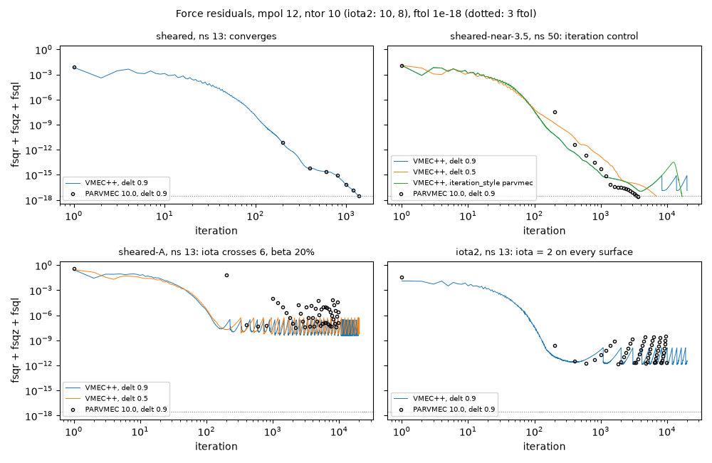
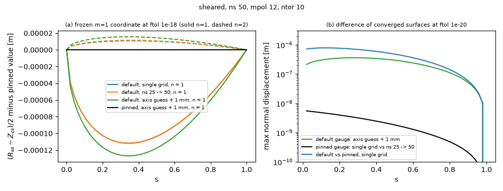
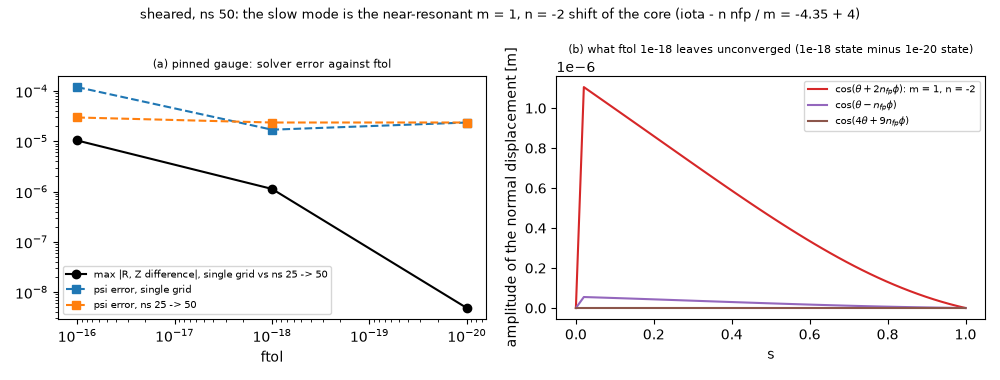

# What limits convergence on the exact equilibria

`examples/exact_equilibria.py` compares VMEC++ with Landreman's exact three-dimensional
equilibria (arXiv:2609.26742). In the quick suite of PR #925, three of the four members
did not reach ftol and the observed orders fell below the expected ones. This note
separates the causes. Unless stated otherwise the runs use mpol 12, ntor 10, delt 0.9
and the member "sheared" (eps 0.6, S 2.2, lambda 2.97, k_b 0.2, VMEC iota -4.34 to
-4.37, beta 1.9 per cent).

Four effects limit the decay, and they need different remedies:

| effect | members | remedy |
|---|---|---|
| no stable equilibrium in reach of the descent | sheared-A, iota2 | choose another member |
| 8.52 time-step control lets a slow mode grow | sheared-near-3.5 at ns >= 50 | delt 0.5 or `iteration_style="parvmec"` |
| m=1 gauge frozen at a history-dependent value | all | pin the gauge from the first iteration |
| slow near-resonant m=1 mode, unconverged at ftol 1e-18 | all, most near low-order resonances | ftol 1e-20 |

## 1. Stalls

For sheared-A and iota2, VMEC++ and PARVMEC 10.0 behave alike on identical inputs. The
residual reaches a floor after 150 to 400 iterations, grows again, is reverted, and the
cycle repeats. More iterations do not help:

| member | full pressure | pressure x 0.25 | pressure 0 | other |
|---|---|---|---|---|
| sheared-A, ns 13 | 7e-8 | 5e-9 | converges, 1029 it | delt 0.5: 9e-8; delt 0.3, parvmec style: 2e-9; iota + 0.5: 2e-8 |
| iota2, ns 13 | 4e-12 | 3e-15 | converges, 6561 it | delt 0.5: 3e-11; iota 2 -> 2.1: converges, 3404 it |

Both converge without pressure. iota2 also converges at full pressure once iota is moved
off 2. With iota = 2 on every surface, the m = 1, n = 1 perturbation has no
field-line-bending stiffness anywhere, so any pressure drive gives the energy a descent
direction. sheared-A has beta 20 per cent and its iota crosses 6. For both, the energy
descent leaves the equilibrium instead of settling on it. That is a property of the
configuration, not of VMEC++.

sheared-near-3.5 at ns 50 is different. PARVMEC converges it in 3644 iterations. VMEC++
with the default VMEC 8.52 control reaches 2e-17 and then grows slowly, at both delt 0.9
and delt 0.81. It converges with delt 0.5 (6916 iterations) and with
`iteration_style="parvmec"` (16822 iterations). The 8.52 control stores a state only at a
new residual minimum and reverts only once the residual exceeds 100 times that minimum.
A mode that grows tenfold over thousands of iterations therefore never triggers a
revert. The per-step damping is dtau = <|d log fsq1|> / 2 over the last 10 steps, so it
falls with the decay rate in the tail.

## 2. The m=1 gauge

`FourierCoeffs::m1Constraint` stores the m = 1 pair as (R_ss + Z_cs)/2 and
(R_ss - Z_cs)/2. The second is treated as the origin of the poloidal angle, and its force
is zeroed once fsqz < 1e-6 (VMEC 8.52). Until then it drifts under its force, and after
that it stays where the history left it. `always_fix_m1_gauge` zeroes that force from the
first iteration and sets the coordinate to the boundary value times sqrt(s).

With the default control, the frozen coordinate ends up to 1.2e-4 m (about 1 per cent of the
m = 1 amplitude) from the pinned value, bump-shaped in s, and different for every
history (a). The pinned coordinate agrees across histories to 1e-19. The shift is
mostly tangential: it moves R and Z by 7.8e-6 m but the surfaces by 3.6e-7 m. Even at
ftol 1e-20, though, two default histories converge to surfaces 3.6e-7 m apart (b):

| ns 50, ftol 1e-20 | psi error | B, s >= 1/4 |
|---|---|---|
| default, single grid | 2.07e-5 | 2.75e-6 |
| default, axis guess + 1 mm | 1.95e-5 | 2.56e-6 |
| pinned, single grid | 2.368e-5 | 2.480e-6 |
| pinned, ns 25 -> 50 | 2.371e-5 | 2.481e-6 |

Relabelling theta -> theta + omega(s, zeta) leaves the continuous problem unchanged, so
why does the frozen value change the result? Two reasons:

- The frozen coordinate is the relabelling direction only for a circular section. On a
  shaped section a relabelling also moves (R_ss + Z_cs)/2 and every other m, and a fixed
  value of the one coordinate is then partly a shape constraint.
- The discrete energy is not invariant under relabelling. R and Z are truncated at mpol
  and ntor in the relabelled angle, radial differences are taken at a fixed label, and
  the spectral-condensation force depends on the angle.

So each frozen value defines its own discrete problem with its own minimizer. The
differences are discretization-sized, but they concentrate in the near-resonant modes:
m = 1, n = -2 at the axis and m = 4, n = 9 (iota near 18/4) at mid-radius. At ftol
1e-18, B for s >= 1/4 at ns 100 is 1.6e-6 with the default gauge and 4.2e-7 with the
pinned gauge. The observed order of 0.70 in CI comes from this.

## 3. The slow mode

With the gauge pinned, the single-grid and the ns 25 -> 50 run still differ at ftol
1e-18. The difference falls with ftol and disappears at 1e-20 (a):

What ftol 1e-18 leaves unconverged is almost entirely one normal displacement,
cos(theta + 2 nfp phi), largest at the first surface and falling towards the fixed
boundary (b). That is m = 1, n = -2: a helical shift of the core against the boundary.
It is the lowest-order near-resonance of this member, since iota - n nfp / m =
-4.35 + 4 = -0.35. Its field-line bending scales with the square of that and is small.
The VMEC preconditioner is diagonal in (m, n) and built from the magnitudes of the
metric terms, so it does not contain this cancellation, and the mode decays slowly. A
residual that is small in fsq still carries a displacement of order F / lambda_min in
this mode. At ns 50, reaching ftol 1e-20 takes 4200 to 5300 iterations, against 2000
to 2400 for 1e-18.

The m = 1 resonance explains the other members too. c1 (eps 1.5, S 2.0, iota 3.77,
0.23 from 4) converges at 1e-18, but its surfaces keep moving at 1e-19. The members
with iota 5.73 (0.27 from 6) did not reach ftol at ns 25.

## Consequences

For the verification:

- Pin the gauge (`always_fix_m1_gauge=True`, currently only through the private
  `_vmecpp.run`).
- Run to ftol 1e-20 at every ns.
- Choose members whose iota keeps away from low-order 2 N / m, in particular m = 1.

With these settings, "sheared" from ns 25 to 50 has observed orders psi 1.61, axis 0.96,
B (s >= 1/4) 2.48 and current 2.03. The member eps 1.15, S 1.65, lambda 4, k_b 0.2
(iota 3.23 to 3.24, beta 0.7 per cent) has psi 1.02, axis 1.16, B 2.04, current 2.14.

For the solver:

- **Gauge.** Pinning the gauge makes the converged state a function of the input only,
  at no measured cost (2034 against 2042 iterations at ns 50). The autodiff path
  already requires it. It deviates from VMEC 8.52 by the size of the history effect,
  so it belongs in its own change: a `VmecInput` field first, then the reference
  comparisons and the shaped and asymmetric cases (w7x, li383, cth, lasym) measured
  with it, then the default.
- **Slow mode.** A residual criterion cannot bound the state error in a soft direction.
  The options are:
  - a Newton-Krylov finisher (the exact force Jacobian exists in Enzyme builds);
  - a preconditioner that carries the (B . grad)^2 term for low m;
  - a stopping criterion on the step size.

  None of these is tested here.
- **Tail control.** In the 8.52 control a slowly growing tail is never reverted. A
  revert on sustained growth, or a smaller delt in the tail, would cover
  sheared-near-3.5. This is also untested beyond the delt and iteration-style runs
  above.
