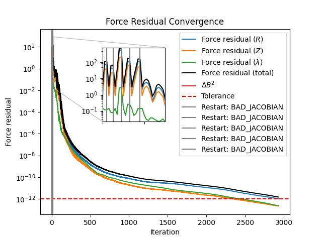

# VMEC++

```{toctree}
:maxdepth: 2
:hidden:

Reference <api/vmecpp>
Examples <examples_overview>
Fourier Basis Details <fourier_basis_implementation>
```


[](https://doi.org/10.5281/zenodo.14800158)

VMEC++ is a Python-friendly, from-scratch reimplementation in C++ of the Variational Moments Equilibrium Code (VMEC),
a free-boundary ideal-MHD equilibrium solver for stellarators and tokamaks.

The original version was written by Steven P. Hirshman and colleagues in the 1980s and 1990s.
The latest version of the original code is called `PARVMEC` and is available [here](https://github.com/ORNL-Fusion/PARVMEC).

Compared to its Fortran predecessors, VMEC++:
- has a zero-crash policy and reports issues via standard Python exceptions
- allows hot-restarting a run from a previous converged state (see [Hot restart](#hot-restart))
- supports inputs in the classic INDATA format as well as simpler-to-parse JSON files; it is also simple to construct input objects programmatically in Python
- typically runs just as fast or faster
- comes with [substantial documentation of its internal numerics](https://github.com/proximafusion/vmecpp/blob/main/docs/the_numerics_of_vmecpp.pdf)

VMEC++ can run on a laptop, but it is a suitable component for large-scale stellarator optimization pipelines.

On the other hand, some features of the original Fortran VMEC are not available in VMEC++.
See [below](#differences-with-respect-to-parvmec-vmec2000) for more details.

```{include} ../README.md
:start-after: <!-- SPHINX-START1 -->
:end-before: <!-- SPHINX-END1 -->
```

```{include} ../README.md
:start-after: <!-- SPHINX-START2 -->
```


## Indices and tables

- {ref}`genindex`
- {ref}`modindex`
- {ref}`search`
