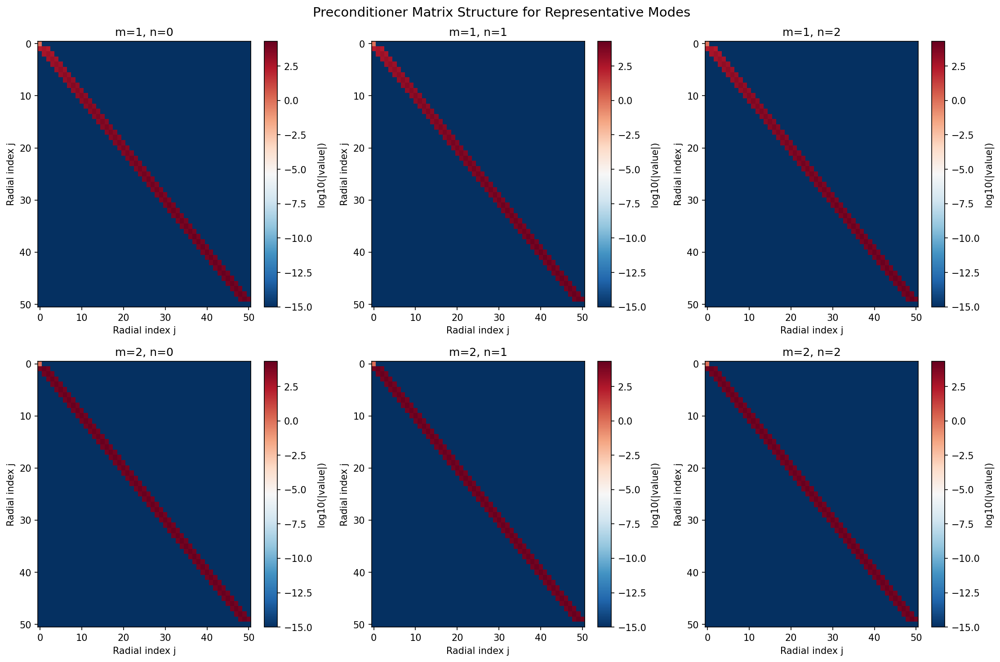
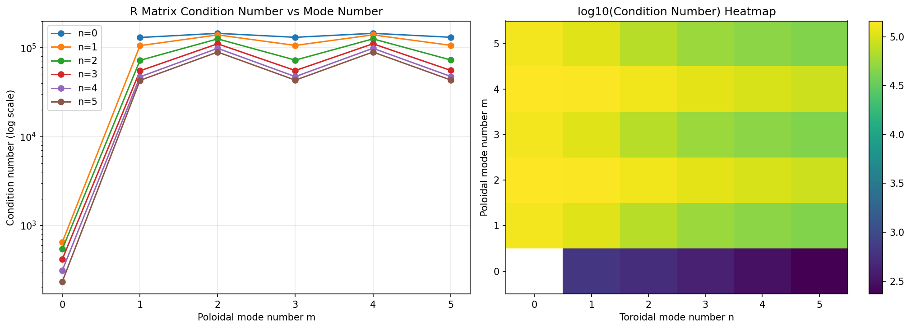
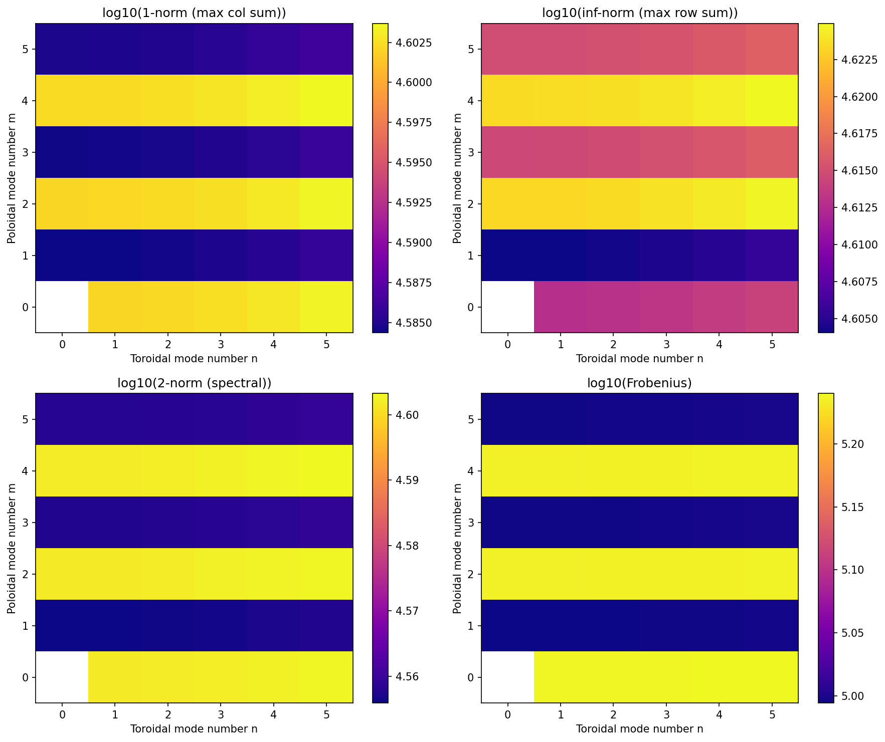
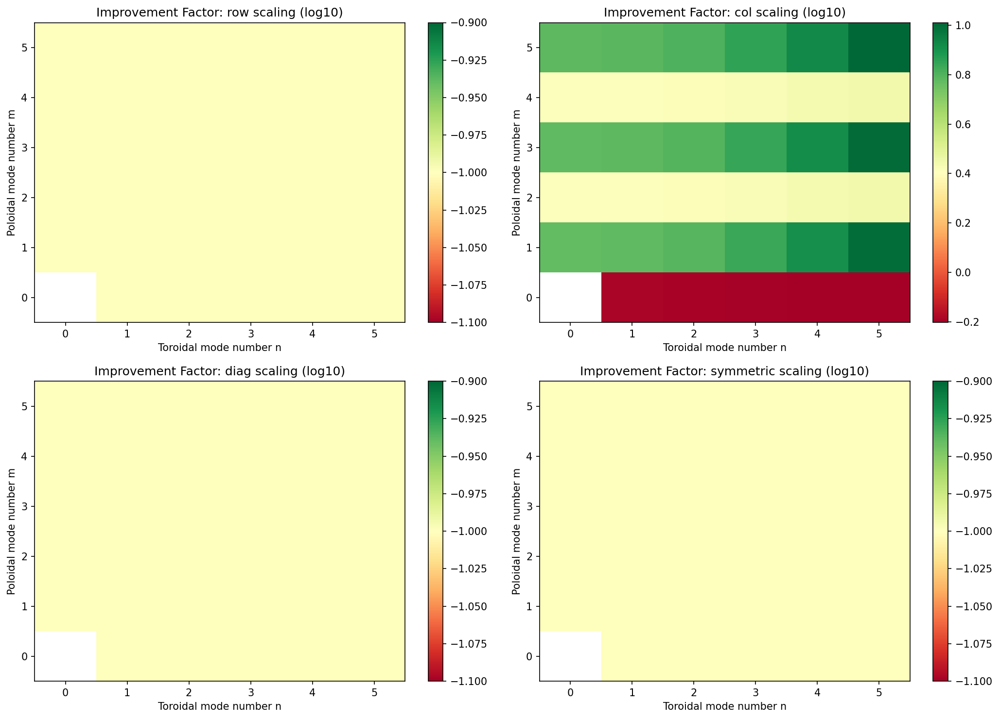
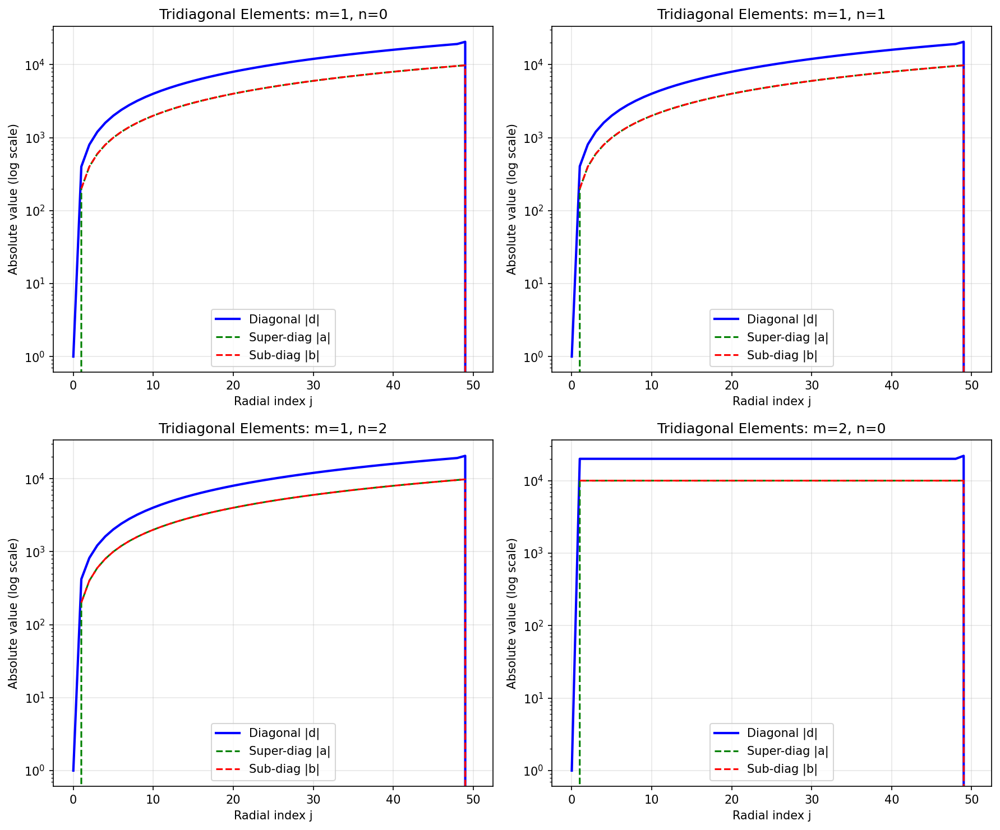
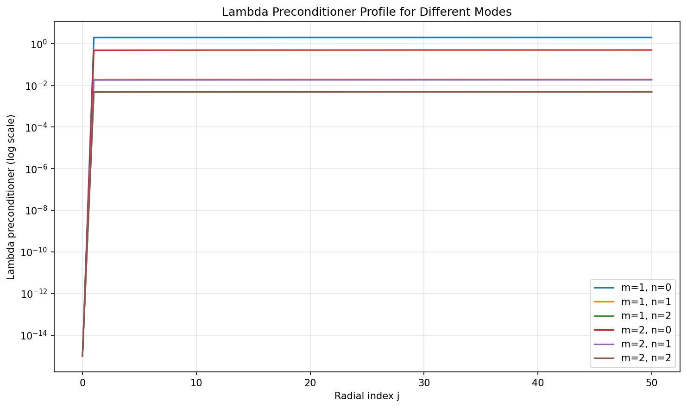

# VMEC++ Radial Preconditioner Analysis Report

## Executive Summary

This report analyzes the radial preconditioner used in VMEC++ for solving
the MHD equilibrium equations. The preconditioner is based on the highest-order
radial derivatives in the MHD force terms and is implemented as a tridiagonal
system for each Fourier mode (m, n).

### Key Findings

- **Total number of Fourier modes analyzed:** 35
- **Grid resolution:** ns=51
- **Fourier truncation:** mpol=6, ntor=5
- **Number of field periods:** nfp=5

### Condition Number Statistics (Original Matrices)

- Minimum: 2.34e+02
- Maximum: 1.45e+05
- Median: 8.95e+04
- Mean: 7.97e+04

### Preconditioning Improvement Factors

| Strategy | Min | Max | Median | Mean |
|----------|-----|-----|--------|------|
| row | 0.00 | 0.05 | 0.03 | 0.03 |
| col | 0.63 | 10.24 | 5.88 | 4.73 |
| diag | 0.00 | 0.05 | 0.03 | 0.03 |
| symmetric | 0.00 | 0.07 | 0.04 | 0.04 |

**Best diagonal preconditioning strategy:** `col` scaling

## Background: Radial Preconditioner Physics

The radial preconditioner in VMEC is derived from the highest-order radial
derivatives in the MHD force terms. Starting from the MHD forces:

```
F_R = d/ds (Z_theta * P) + ...
F_Z = -d/ds (R_theta * P) + ...
```

where P = R * (p + |B|^2 / (2 * mu_0)) is the total pressure times R.

The second-order radial derivatives appear through terms like:

```
d(sqrt(g))/ds = R * (R_theta * d^2Z/ds^2 - Z_theta * d^2R/ds^2) + ...
```

These terms dominate the preconditioner and lead to a tridiagonal structure
in the radial direction for each Fourier mode.

## Analysis Results

### Matrix Structure



The tridiagonal structure of the preconditioner matrix is clearly visible.
The matrix couples adjacent radial surfaces, with the diagonal elements
being dominant. The sparsity pattern is nearly identical for all modes.

### Condition Numbers



The condition number varies significantly with mode number:

- Higher poloidal modes (larger m) tend to have larger condition numbers
- The (m=0, n=0) mode is excluded (trivial)
- Edge effects and the axis treatment contribute to the conditioning

### Matrix Norms



Different matrix norms reveal the scaling behavior:

- The 1-norm and inf-norm show similar patterns due to the tridiagonal structure
- The 2-norm (spectral norm) correlates with the condition number
- The Frobenius norm indicates the overall 'size' of the matrix

### Diagonal Preconditioning Improvement



We analyzed four diagonal preconditioning strategies:

1. **Row scaling:** Scale each row by its infinity norm
2. **Column scaling:** Scale each column by its 1-norm
3. **Diagonal scaling:** Scale by absolute diagonal elements
4. **Symmetric scaling:** Geometric mean of row and column norms

The **col** scaling provides the best improvement on average.

### Tridiagonal Element Profiles



The radial profiles of the tridiagonal elements show:

- Diagonal elements are typically larger than off-diagonal elements
- There is significant variation near the magnetic axis (j=0) and LCFS (j=ns-1)
- The odd-m modes have different scaling near the axis due to sqrt(s) factors

### Lambda Preconditioner



The lambda preconditioner (for the magnetic stream function) is diagonal
and based on the metric elements. Key observations:

- Higher modes (larger m, n) have smaller preconditioner values
- There is additional damping for high-m modes (m > 16)
- The preconditioner approaches zero near the magnetic axis

## Recommendations

Based on this analysis, we recommend the following improvements to the
radial preconditioner:

1. **Apply col diagonal scaling** as an additional preconditioning step.
   This can improve the condition number by a factor of 5.9x on average.

2. **Consider mode-dependent scaling** since condition numbers vary significantly
   across different (m, n) modes.

3. **Edge treatment:** The current edge pedestal (5% increase) helps but could
   be optimized based on the condition number analysis.

4. **Axis treatment:** The m=1 modes require special handling near the axis
   which contributes to the conditioning. This could be refined.

## Technical Details

### Tridiagonal System Structure

For each Fourier mode (m, n), the preconditioner represents the system:

```
a[j] * x[j+1] + d[j] * x[j] + b[j] * x[j-1] = c[j]
```

where:
- j ranges from 0 (magnetic axis) to ns-1 (LCFS)
- a[j] contains the d^2/ds^2 and m^2 contributions coupling to j+1
- d[j] contains the diagonal contributions from both neighbors plus n^2 terms
- b[j] contains the coupling to j-1
- c[j] is the force vector (RHS)

### Boundary Conditions

- **Magnetic axis (j=0):** For m > 0, the coefficients are set to the identity
  (d[0]=1, a[0]=b[0]=0) since the axis has no poloidal structure.
- **LCFS (j=ns-1):** An edge pedestal is added to improve convergence,
  especially important for free-boundary cases.

## Data Files

The following files were generated:

- `matrix_structure.png`: matrix structure
- `condition_numbers.png`: condition numbers
- `matrix_norms.png`: matrix norms
- `preconditioning_improvement.png`: preconditioning improvement
- `tridiagonal_elements.png`: tridiagonal elements
- `lambda_preconditioner.png`: lambda preconditioner

